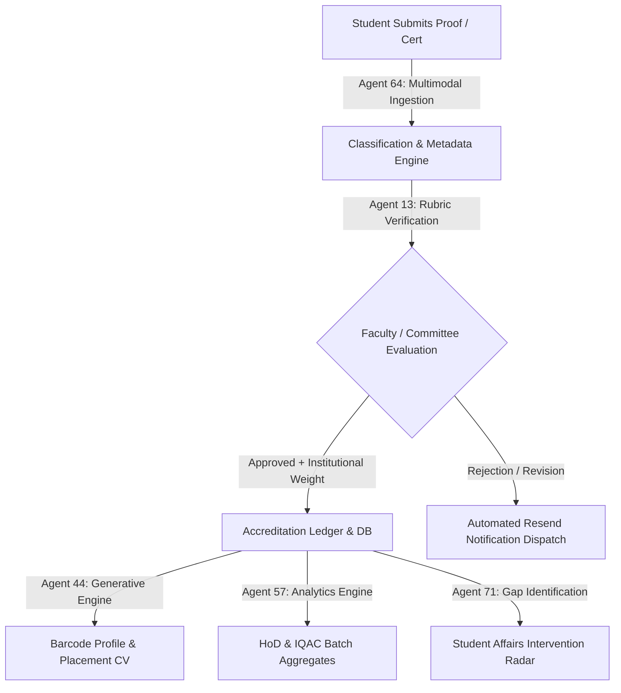

<div align="center">

# 🎓 VFSTR Student Achievement Verification & Intelligence System
### **Autonomous Multi-Agent Employability & Accreditation Intelligence Platform**

[-gold?style=for-the-badge&logo=award)](https://vignan.ac.in)
[](https://vignan.ac.in)
[](https://vignan.ac.in)
[](https://vignan.ac.in)
[](https://nodejs.org)
[](package.json)

<p align="center">
  <b>Vignan's Foundation for Science, Technology & Research (Deemed to be University)</b><br>
  <i>Internal Quality Assurance Cell (IQAC) · Department of Computer Science & Engineering</i>
</p>

---

</div>

## 📌 Executive Overview

The **VFSTR Student Achievement Verification & Intelligence System (AEPS)** is an institutional, multi-agent AI web application designed to capture, classify, verify, and index co-curricular, extra-curricular, and technical achievements of students across all university departments.

Engineered directly for institutional accreditation standards:
* **NAAC SSR Criteria 5.3** *(Student Participation and Activities)*
* **NIRF #73 Metrics** *(Graduation Outcomes & Perception)*
* **NBA Tier-1 Outcome-Based Education (OBE)** *(Continuous Program Assessment)*
* **Placement & Industry Engagement** *(Generative Verifiable Student Resumes & Barcode Credentials)*

---

## 🌟 Key Highlights & Innovations



### 1. 🤖 6-Agent Autonomous Architecture
* **⚡ Agent 64 (Multimodal Ingestion)**: Extracts certificates, hackathon rankings, research papers, patents, and sports credentials via SHA-256 evidence indexing.
* **⚖️ Agent 13 (Rubric & Fraud Verification)**: Matches claims against institutional scoring weights with multi-tiered faculty sign-off.
* **📄 Agent 44 (Generative Placement CV & Barcode Profile)**: Produces dynamic, recruiter-ready resumes and tamper-evident QR/Barcode student portfolios.
* **📊 Agent 57 (Department & Batch Aggregates)**: Computes real-time achievement indexes, top rankers, and accreditation metrics for HoDs and Deans.
* **🚨 Agent 71 (Participation Gap Detector)**: Detects passive students across branches and triggers engagement intervention campaigns.
* **🌐 Agent 48 (Ecosystem Orchestrator)**: Unified multi-role orchestration pipeline connecting all 8 institutional stakeholders.

### 2. 👥 8 Role-Separated Portals
| Portal | Primary Responsibility | Key Interfaces |
| :--- | :--- | :--- |
| **Student** | Submit proof, track status, generate CV | My Dashboard, Submit Proof, Barcode Profile, Generative CV |
| **Faculty** | Evaluate & score student evidence | Verification Queue, Multi-Source Inputs, Evidence Archive |
| **HoD** | Departmental oversight & analytics | HoD Hub, Batch Aggregates, Branch Gaps, Verification Audit |
| **Student Affairs** | Welfare, outreach & engagement | Participation Gaps, Intervention Campaigns, Welfare Roster |
| **Placement Cell** | Recruiter CV vault & hiring shortlists | Candidate Directory, Verified Resumes, Skill Badging |
| **IQAC** | NAAC 5.3 & NIRF institutional compliance | Accreditation SSR Ledger, Evidence Vault, Rubric Matrix |
| **Recognition** | Awards & incentive distribution | Recognition Roster, Cash Prize Matrix, Top Achievers |
| **Admin** | System health, permissions & sync | Platform Health, Config API, Master DB Sync |

---

## 🔒 Enterprise Resource Protection Shield

The application includes an automated, server-level security shield ensuring safe deployment on the public internet:

* 🛡️ **Zero-Leak Server Firewall**: Any direct HTTP attempt to fetch `.env`, `server.js`, `package.json`, `data/achievements.json`, or hidden dotfiles (`.git`) is blocked with an immediate **`403 Forbidden`**.
* 🌐 **Public Whitelist Asset Delivery**: Strictly serves `/css/`, `/js/`, `/images/`, `/favicon.ico`, and root SPA routes.
* 🔑 **Client-Side Secret Sanitization**: Zero private API keys in client JavaScript. All Resend email notifications and backend mutations are strictly executed on the server.
* ⚡ **Anti-Abuse Rate Limiting**: Built-in IP rate limiter protecting email dispatch and write endpoints against automated spam.
* 🚦 **Security Headers**: Standard `X-Content-Type-Options: nosniff`, `X-Frame-Options: SAMEORIGIN`, and `Referrer-Policy: strict-origin-when-cross-origin`.

---

## 🚀 Quick Start (Localhost Server)

### Prerequisites
* [Node.js](https://nodejs.org) (v16.0.0 or higher)
* Zero external NPM runtime dependencies required.

### 1. Clone & Setup
```bash
git clone https://github.com/your-org/vfstr-student-achievement-agent.git
cd vfstr-student-achievement-agent
```

### 2. Configure Environment Variables
Copy the template file to `.env`:
```bash
cp .env.example .env
```

> **🔒 Security Notice**: Real API keys are loaded strictly from `.env` on your local server or through your cloud provider's environment variables. The `.env` file is excluded in `.gitignore` and protected by the server firewall.

Edit `.env` with your credentials:
```env
PORT=5000

# Supabase Client Key (Public - Safe for browser)
SUPABASE_PUBLISHABLE_KEY=your_supabase_publishable_key_here

# Resend API Secret Key (Private - Kept strictly server-side)
RESEND_API_KEY=your_resend_api_key_here
RESEND_FROM_EMAIL=onboarding@resend.dev

# Administrative Service Token (Private - Kept strictly server-side)
gemini_api_key=you_gemini_api_key
```

### 3. Launch the Server
```bash
npm start
# or: npm run dev
```

Open your browser at **[http://localhost:5000/](http://localhost:5000/)** *(or [http://127.0.0.1:5000/](http://127.0.0.1:5000/))*.

---

## ☁️ Production Web Deployment

The application is structured for one-click deployment across all major cloud hosting platforms:

<details>
<summary><b>Deploy to Render</b></summary>

1. Create a new **Web Service** on [Render](https://render.com).
2. Connect your Git repository.
3. Configure settings:
   - **Environment**: `Node`
   - **Build Command**: *(Leave empty)*
   - **Start Command**: `npm start`
4. Add your Environment Variables (`RESEND_API_KEY`, `SUPABASE_PUBLISHABLE_KEY`, etc.).
5. Deploy!
</details>

<details>
<summary><b>Deploy to Railway</b></summary>

1. Create a **New Project** on [Railway](https://railway.app).
2. Deploy from your GitHub repo.
3. Set your environment variables in the Railway dashboard.
4. Railway automatically reads `package.json` and runs `npm start`.
</details>

<details>
<summary><b>Deploy via Docker / Custom VPS</b></summary>

```bash
# Pull and start directly using Node
PORT=80 node server.js
```
</details>

---

## 📡 REST API Reference

| Endpoint | Method | Access | Description |
| :--- | :---: | :---: | :--- |
| `/api/health` | `GET` | Public | Cloud health check (uptime, node version, service status). |
| `/api/config` | `GET` | Public | Safe public institutional metadata and public keys. |
| `/api/achievements` | `GET` | Authenticated | Retrieves validated student achievements ledger. |
| `/api/achievements` | `POST` | Role-Guarded | Submits or updates records with role-based status sanitization. |
| `/api/email/send` | `POST` | Rate-Limited | Dispatches evaluation notices to students via Resend. |

---

## 📂 Project Directory Structure

```text
vfstr-student-achievement-agent/
├── css/
│   └── style.css            # Liquid Glass Design System & Theme Engine
├── data/
│   └── achievements.json    # Local JSON Achievement Persistence Ledger
├── images/
│   ├── accreditation_badges.png # Official NAAC / NIRF / NBA / AICTE Crest
│   ├── campus_bg.jpg            # University Campus High-Res Background
│   ├── vignan_logo.png          # Official VFSTR University Crest
│   └── user_avatar_3d.png       # 3D Profile Avatar Asset
├── js/
│   ├── app.js               # Router, Sidebar Engine, Navigation & API Sync
│   ├── classify.js          # AI Multimodal Document Classifier
│   ├── cv.js                # Generative Placement CV Engine (Agent 44)
│   ├── dashboard.js         # Student Analytics & Points Aggregation
│   ├── data.js              # Mock Data Store, Rubric Specs & Headers
│   ├── faculty.js           # Faculty Hub, Aggregates & Gap Intervention
│   ├── profile.js           # Barcode Identity Card Engine (Agent 44)
│   ├── upload.js            # Proof Ingestion & Verification UI (Agent 64)
│   └── verify.js            # Certificate Inspector & Fast Check Modal
├── .env.example             # Safe Environment Configuration Template
├── .gitignore               # Deployment Security Exclusion Rules
├── index.html               # Semantic SPA Web Application Shell
├── package.json             # NPM Project Manifest & Engine Constraints
├── README.md                # Institutional Documentation
└── server.js                # Zero-Dependency Protected Node.js HTTP Server
```

---

## 🏆 Institutional Compliance Matrix

| Accreditation Body | Target Standard | AEPS Implementation |
| :--- | :--- | :--- |
| **NAAC** | Criteria 5.3.1 & 5.3.2 | Automated computation of student awards in sports/cultural/technical events. |
| **NIRF** | Metric 3 & 4 (Graduation & Perception) | Verified student employability portfolios and competition podium logs. |
| **NBA** | Criterion 9 (Student Support) | Rubric-mapped points system aligned with PO / PSO achievement indicators. |
| **AICTE** | Activity Points Mandate | Tiered institutional points scale (10 to 100 pts) per verified certificate. |

---

<div align="center">

**VFSTR Student Achievement Intelligence System**  
*Internal Quality Assurance Cell (IQAC) · Vignan's Deemed to be University, Vadlamudi, Guntur, AP, India*

</div>
